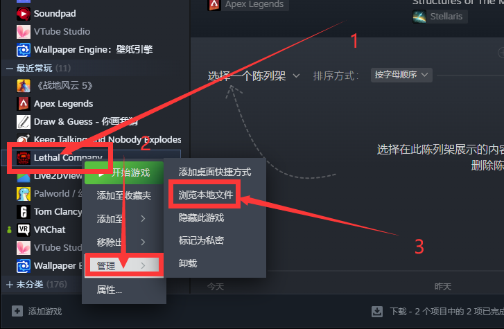
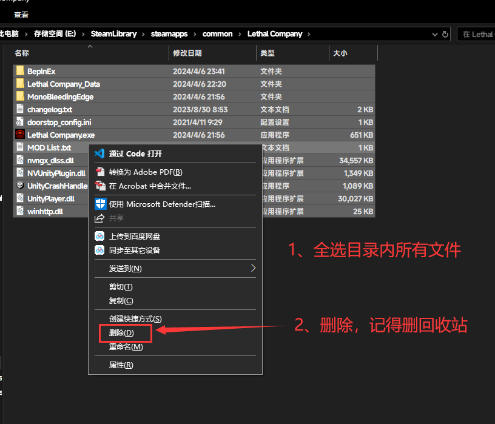
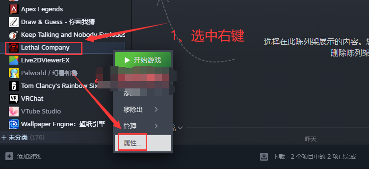
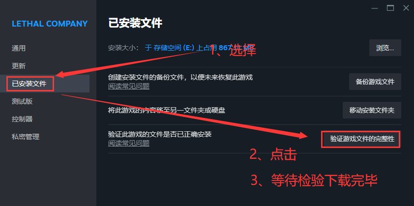
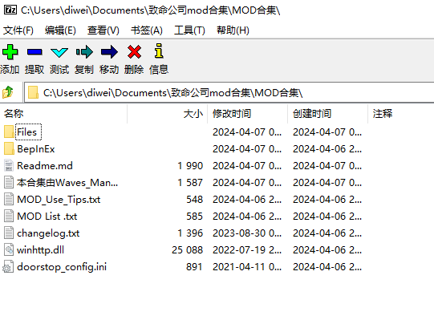
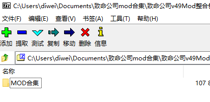
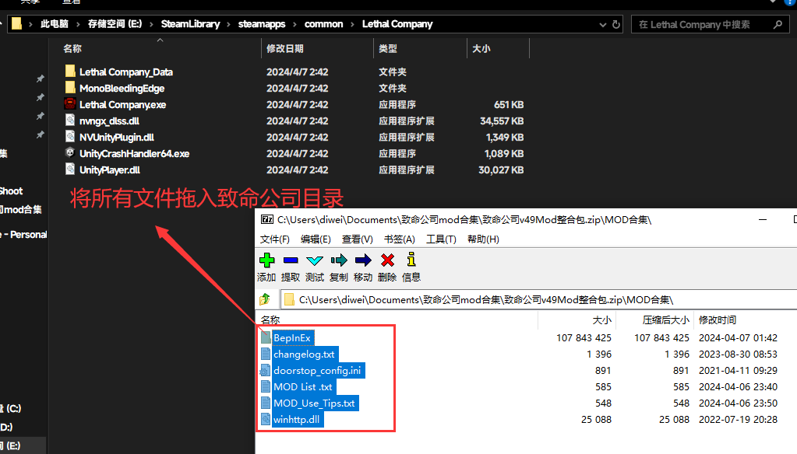
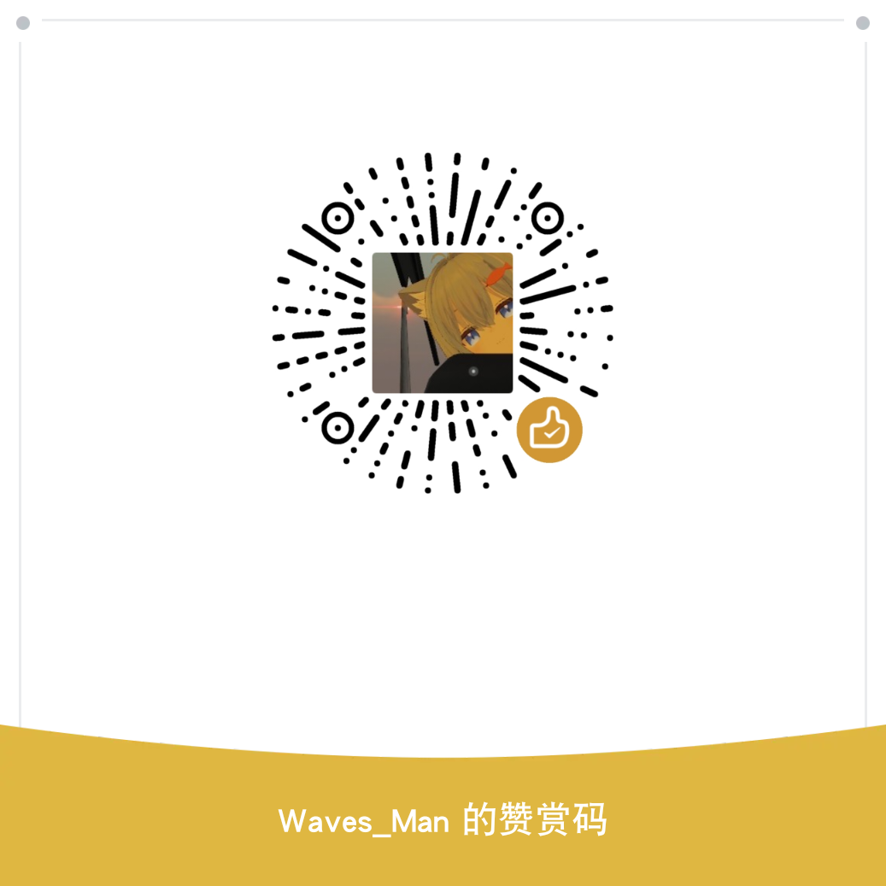

## 写在前面

[Waves_Man个人主页](https://space.bilibili.com/478191001)
**本整合包为免费资源，如果你被收费了那么你被骗了**

整合包资源全部来自网络整合优化

汉化内容来自 [吹到江心的孤雪 小本杰明儿 炸飞Victor 制](https://www.guxue.online)     

Waves_Man新增部分汉化内容适配MOD插件

## 版本信息

当前整合包最新版本v1.2.0

适配致命公司v49版本

使用前请阅读“MOD_Use_Tips.txt”

## 下载

GitHub库：[戳此链接](https://github.com/WavesMan/Lethal_Company-Integration-package)

Gitee仓库：[戳此链接](https://gitee.com/waves-man/Lethal_Company-Integration-package)

下载：[GitHub下载](https://github.com/WavesMan/Lethal_Company-Integration-package/releases)

           [Gitee下载](https://gitee.com/waves-man/Lethal_Company-Integration-package/releases)

           [123网盘下载](https://www.123pan.com/s/hbHPjv-Ox1MA.html)

## MOD列表

##### 汉化包：

    简中汉化包-吹到江心的孤雪 小本杰明儿 炸飞Victor 制

    Waves_Man优化新增MOD汉化
————————————————————————————————————

##### API前置包：

    BenpinEx & MonoMod_API

    BepInEx v5.4.22通用Unity插件前置

    Config工具包-AinaVT-LethalConfig-1.4.0

    专用物品栏前置API-ReservedItemSlotCore-2.0.17

    礼物盒开奖前置

    MOD列表插件

————————————————————————————————————   

##### 游戏性优化包：

    高清资源包

    对讲机专栏

    手电筒专栏

    更多玩家

    更精准的价值

    局内加入MOD

    千克显示法

    头盔摄像头

    装备快捷键

    验尸官

    无限喷漆

    听到所有的对讲机

    更好的逆向传送

    更好的HUD

    ShipClock-0.9.0

————————————————————————————————————

##### 玩法包：

    拟声怪

    抽奖公司

    飞船升级系统

    更多手势

    假门

    人物技能升级系统

    死后观察怪物

    随机事件（New）

    更多的动作

————————————————————————————————————

## 卸载安装

第一步：打开Steam按图示操作

第二步

第三步：

第四步：

第五步：前往“$下载$”下载整合包，并打开整合包

第六步：打开整合包“**zip文件**”，并<u>**<mark>重复</mark>**</u><mark>“第一步”</mark>

第七步：当zip文件显示情况<mark>如下图一</mark>时，而<mark>非图二</mark>时执行**第八步**

第八步：全选zip文件中所有文件拖入（解压）进致命公司根目录（如图）

## BUG兼容性问题

1. 访问  https://space.bilibili.com/478191001  私信写清楚BUG产生性状，与是否有安装其他MOD

2. 提交issues→[戳](https://github.com/WavesMan/Lethal_Company-Integration-package/issues/new)

## 更新

##### 4月8日    v1.2.0

    - 新增    <专用物品栏前置API-ReservedItemSlotCore-2.0.17>

                  <装备快捷键>

                  <听到所有的对讲机>

                  <验尸官>

                 `<ShipClock-0.9.0>`

                  <无限喷漆>

                  <更好的HUD>

                  <更好的逆向传送>

                  <更多的动作>

    - 移除    <更多装备栏>`[兼容性移除]`

##### 4月7日    v1.1.0

    - 新增    <自动翻译模块-XUnity.AutoTranslator>

                  <自动翻译config>

                  <新随机事件新随机事件>

                  <适配MOD汉化包 - Waves_Man 译>

## 兼容性测试

##### 4月8日测试

    `<更多装备栏>`与`<对讲机专栏><手电筒专栏>`冲突，移除`<更多装备栏>`

## 赞助

#### 微信赞赏码

#### 支付宝赞助

